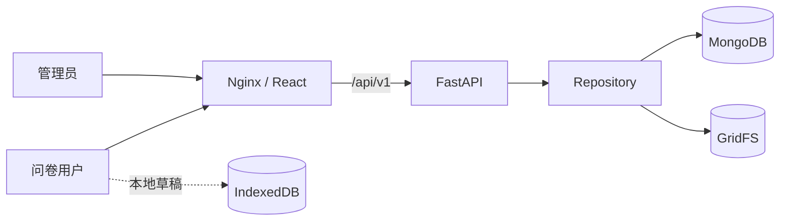

# Questionnaire-collection-system

一套面向产品调研与需求收集场景的全栈问卷系统。项目提供响应式问卷填写、浏览器草稿、附件上传、幂等提交，以及带筛选、导出和问卷版本管理能力的管理后台。

## 功能概览

### 问卷端

- 分步骤填写角色、重点页面、功能评分、问题证据和补充反馈
- 草稿自动保存在浏览器 IndexedDB，刷新后可继续填写
- 支持图片附件预览、校验、上传和异常提交恢复
- 问卷配置由后端发布版本驱动，历史提交保留对应版本
- 响应式布局，适配桌面端和移动端

### 管理端

- 管理员会话登录与同源请求保护
- 按日期、问卷版本、角色、页面、关键词和附件状态筛选
- 查看提交详情与附件，导出单条 JSON 或批量 CSV
- 编辑问卷草稿，通过修订号检测并发冲突
- 发布新版本并归档旧版本，查看各版本提交数量

### 工程能力

- MongoDB 唯一索引保证提交幂等性
- GridFS 保存附件，后台任务清理孤立文件
- FastAPI 存活与就绪探针
- Docker Compose 一键构建、健康检查和滚动更新
- 前后端单元测试，MongoDB 集成测试按需启用

## 技术栈

| 模块 | 技术 |
| --- | --- |
| 前端 | React 19、TypeScript、Vite、Vitest、Testing Library |
| 后端 | Python 3.13、FastAPI、Pydantic、PyMongo Async API、pytest |
| 数据 | MongoDB、GridFS、IndexedDB |
| 部署 | Docker Compose、Nginx、Uvicorn |

## 系统架构



## 目录结构

```text
.
├── frontend/                  # React 问卷端与管理端
│   └── src/
│       ├── admin/             # 管理后台页面与 API
│       ├── components/        # 通用组件
│       ├── features/survey/   # 问卷业务模块
│       ├── services/          # API 与本地存储
│       └── shared/            # 共享配置
├── backend/                   # FastAPI 服务
│   ├── app/
│   │   └── repositories/      # 附件、问卷、提交仓储
│   ├── scripts/               # 管理与维护脚本
│   └── tests/                 # 后端测试
├── docker/                    # 镜像、Compose、Nginx 与部署脚本
└── docs/                      # 需求和设计文档
```

## 本地开发

### 环境要求

- Node.js 20+
- Python 3.13+
- [uv](https://docs.astral.sh/uv/)
- MongoDB 7+

### 启动后端

```bash
cd backend
uv sync
export MONGODB_URI='mongodb://127.0.0.1:27017'
export MONGODB_DATABASE='questionnaire_collection'
uv run uvicorn app.main:app --reload --port 8000
```

### 启动前端

前端开发服务器会将 `/api` 代理到 `127.0.0.1:8000`。

```bash
cd frontend
npm ci
npm run dev
```

访问地址：

- 问卷端：`http://localhost:5173/`
- 管理后台：`http://localhost:5173/admin`
- API 文档：`http://localhost:8000/docs`

## 管理员配置

管理员密码只接受 Argon2 哈希，不要在配置文件中保存明文密码。

```bash
cd backend
uv run python -c "from pwdlib import PasswordHash; print(PasswordHash.recommended().hash(input('Admin password: ')))"
openssl rand -hex 32
```

将第一条命令的输出配置为 `ADMIN_PASSWORD_HASH`，第二条命令的输出配置为 `ADMIN_SESSION_SECRET`。HTTPS 部署时应设置 `ADMIN_SECURE_COOKIE=true`。

| 环境变量 | 必填 | 默认值 | 说明 |
| --- | --- | --- | --- |
| `MONGODB_URI` | 是 | 无 | MongoDB 连接地址 |
| `MONGODB_DATABASE` | 否 | `dml_v4_survey` | 数据库名称 |
| `ADMIN_USERNAME` | 否 | `admin` | 管理员用户名 |
| `ADMIN_PASSWORD_HASH` | 是 | 无 | Argon2 密码哈希 |
| `ADMIN_SESSION_SECRET` | 是 | 无 | 至少 32 字符的会话签名密钥 |
| `ADMIN_SECURE_COOKIE` | 否 | `false` | HTTPS 环境设为 `true` |
| `LOG_LEVEL` | 否 | `INFO` | 后端日志级别 |

## 测试与构建

```bash
# 前端
cd frontend
npm test
npm run lint
npm run build

# 后端
cd ../backend
uv run pytest
```

MongoDB 集成测试默认跳过。请使用独立测试数据库，并显式开启：

```bash
cd backend
RUN_MONGO_INTEGRATION=1 \
MONGODB_URI='mongodb://127.0.0.1:27017' \
uv run pytest tests/test_mongo_integration.py
```

## Docker 部署

```bash
cp docker/.env.example docker/.env
# 编辑 docker/.env，填入 MongoDB 和管理员配置
./docker/compose.sh up -d --build
```

默认入口为 `http://localhost:8080`，可以通过 `WEB_PORT` 修改映射端口。项目路径包含中文时，请继续使用 `docker/compose.sh`，脚本会处理部分 Docker Desktop/Buildx 版本的路径兼容问题。

代码更新后可以按服务重新部署：

```bash
./docker/redeploy.sh frontend
./docker/redeploy.sh backend
./docker/redeploy.sh all --check
```

`--check` 会在部署前运行对应测试和前端 lint。完整部署会先等待后端健康，再更新前端。

## 常用接口

| 方法 | 路径 | 用途 |
| --- | --- | --- |
| `GET` | `/api/v1/health/live` | 存活检查 |
| `GET` | `/api/v1/health/ready` | MongoDB 就绪检查 |
| `GET` | `/api/v1/surveys/current` | 获取当前发布问卷 |
| `POST` | `/api/v1/submissions` | 提交问卷与附件 |
| `POST` | `/api/v1/admin/auth/login` | 管理员登录 |
| `GET` | `/api/v1/admin/submissions` | 查询提交记录 |
| `GET` | `/api/v1/admin/submissions/export.csv` | 导出筛选结果 |
| `PUT` | `/api/v1/admin/surveys/{survey_key}/draft` | 保存问卷草稿 |
| `POST` | `/api/v1/admin/surveys/{survey_key}/publish` | 发布问卷版本 |

## 安全说明

- `docker/.env` 已被 Git 忽略，禁止提交真实密码、会话密钥或数据库凭据。
- 生产环境应启用 HTTPS，并将 `ADMIN_SECURE_COOKIE` 设置为 `true`。
- 管理接口使用签名会话 Cookie，并对写操作执行同源校验。
- CSV 导出会转义公式前缀，降低表格软件公式注入风险。
