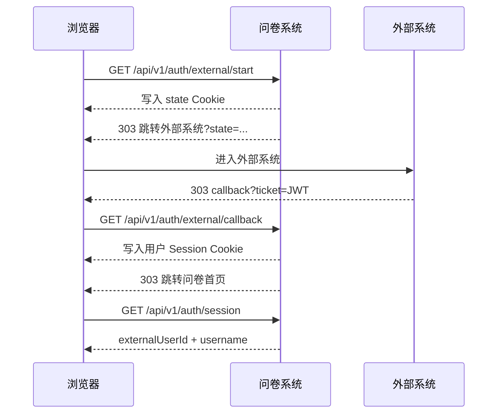

# 2026-07-27 工作日志

## 今日目标

实现问卷系统与外部业务系统之间的用户身份跳转：使用最少代码模拟外部系统，携带用户 ID 和 `username` 进入问卷，在前端显示用户名，并在提交问卷时保存可信用户身份。同时完成本地服务启动、内置浏览器联调、安全加固和接入文档整理。

## 已完成工作

### 1. 最小模拟外部系统

- 新增 `backend/mock_external.py`，使用单个 FastAPI 文件提供模拟外部系统。
- 页面只包含用户 ID、`username` 和“进入问卷”按钮，保持演示代码最小化。
- 未携带 `state` 访问模拟系统时，自动回到问卷登录起点发起完整流程。
- 模拟系统服务端使用 HS256 签发短时 JWT，并通过 303 跳转返回问卷回调地址。
- 本地模拟服务运行于 `http://127.0.0.1:9000/`。

### 2. 外部登录跳转流程

- 新增 `GET /api/v1/auth/external/start` 作为统一登录起点。
- 问卷系统生成随机 `state`，通过 HttpOnly Cookie 绑定当前浏览器，再跳转外部系统。
- 新增 `GET /api/v1/auth/external/callback`，验证外部系统返回的 JWT 票据。
- 票据包含 `iss`、`aud`、`sub`、`username`、`iat`、`exp`、`jti`、`state` 和 `token_type`。
- 回调成功后建立独立的问卷用户会话，并清理地址栏中的短时票据。
- 新增 `GET /api/v1/auth/session` 和 `POST /api/v1/auth/logout`，支持前端查询登录状态和退出登录。

### 3. 登录安全加固

- 外部票据默认最长有效 60 秒，并校验签发方、接收方、票据类型和时间范围。
- 使用 `state` Cookie 防止登录 CSRF 和会话替换。
- 使用 MongoDB `consumed_external_tickets` 集合记录已消费的 `jti`。
- 为 `jti` 建立唯一索引，防止同一票据重复使用。
- 为票据过期时间建立 TTL 索引，自动清理历史消费记录。
- 外部票据密钥、问卷用户会话密钥和管理员会话密钥必须彼此独立。
- 长度不足或公开示例密钥会被程序拒绝。
- 用户 ID 与用户名会去除首尾空白，并拒绝控制字符。
- 生产环境支持 Secure、HttpOnly、SameSite Cookie。

### 4. 问卷前端用户状态

- 页面初始化时同时加载问卷配置和当前用户会话。
- 登录后在右上角显示 `username` 和退出按钮。
- 未登录时保留匿名填写能力，并显示“登录填写，有机会获得奖励”入口。
- 会话接口异常时阻止继续加载，避免把网络错误误判为匿名用户。
- 登录、退出和问卷刷新后均会重新读取后端会话状态。

### 5. 用户草稿与附件隔离

- 浏览器草稿按外部用户 ID 分区保存，避免不同登录用户共用同一份草稿。
- 附件 IndexedDB 记录同步按用户归属隔离。
- 匿名用户登录后支持迁移待认领草稿。
- 如果登录账号已经存在草稿，保留账号草稿，并明确提示匿名草稿冲突，避免静默覆盖。
- 清理旧版浏览器存储数据，降低历史结构与当前草稿格式冲突的风险。

### 6. 提交问卷时保存可信身份

- 前端提交数据不再自行声明可信用户身份。
- 后端从 `dml_user_session` HttpOnly Cookie 解析当前用户。
- 登录提交在 MongoDB 文档中写入：

```json
{
  "respondent": {
    "auth_type": "external",
    "external_user_id": "demo-1001",
    "username": "张三"
  }
}
```

- 匿名提交写入 `respondent.auth_type=anonymous`。
- 用户身份参与幂等请求摘要，防止同一问卷 ID 被不同身份重复提交为相同请求。
- 登录用户提交必须通过同源校验；匿名提交仍保持公开可用。

### 7. 管理端身份展示

- 提交列表和详情增加登录类型、外部用户 ID 和用户名。
- 支持按认证类型、用户名筛选提交记录。
- 关键词搜索支持匹配用户名。
- CSV 导出增加身份字段，便于后续统计和用户回访。
- 为提交记录的外部用户 ID 和用户名建立 MongoDB 查询索引。

### 8. 退出按钮问题修复

- 内置浏览器复现右上角退出按钮点击后提示“退出失败，请稍后重试”。
- 确认根因是 Vite 开发代理转发到 Docker Nginx 后，后端看到的 Host/协议与浏览器原始 Origin 不一致，同源校验返回 403。
- 在 `frontend/vite.config.ts` 中配置开发代理的可信转发边界。
- 保留浏览器原始 Origin，并覆盖客户端可能伪造的 `X-Forwarded-Host`、`X-Forwarded-Proto`、`X-Forwarded-For` 和 `X-Forwarded-Port`。
- Host、协议、地址和端口只从 Vite 实际入站请求及 Socket 获取，未放宽后端安全校验。
- 修复后再次登录“张三”，点击退出成功；用户名和退出按钮消失，登录入口恢复，刷新后仍保持匿名状态。

### 9. Docker 与本地联调

- 重建问卷后端 Docker 镜像并更新容器。
- Docker 后端连接现有 MongoDB，健康状态为 `healthy`。
- 启动 Vite 问卷前端并代理到 Docker 集成服务。
- 启动模拟外部系统，保持完整跳转链路可测试。
- 内置浏览器实际完成以下链路：
  - 问卷登录起点生成 `state`。
  - 跳转模拟外部系统。
  - 提交 `demo-1001 / 张三`。
  - 跳回问卷首页。
  - 右上角显示“张三”。
  - 退出后恢复匿名状态。

### 10. 文档补充

- 更新 README，补充外部登录能力、启动方式、环境变量和 API 入口。
- 新增 `docs/外部系统跳转接入说明.md`。
- 接入文档包含系统职责、Mermaid 时序图、JWT 字段、会话建立、用户身份保存、本地联调、安全要求和常见错误。
- README 的“外部系统接入协议”章节已增加完整文档入口。

## 核心跳转流程



## 当前服务地址

- 模拟外部系统：`http://127.0.0.1:9000/`
- 问卷开发前端：`http://127.0.0.1:5174/`
- Docker 集成入口：`http://127.0.0.1:8080/`
- Docker 管理后台：`http://127.0.0.1:8080/admin`
- Docker API 健康检查：`http://127.0.0.1:8080/api/v1/health/ready`

## 验证结果

- 后端测试：`41 passed, 3 skipped`。
- 前端测试：`23 passed`。
- 前端 ESLint：通过。
- 前端 TypeScript 与生产构建：通过。
- `git diff --check`：通过。
- Docker 后端：`healthy`。
- 模拟外部系统签发和 303 回调：通过。
- 用户名右上角显示：通过。
- 登录用户身份随问卷保存：自动化测试通过。
- 匿名提交兼容：自动化测试通过。
- 退出登录及刷新后状态：内置浏览器验证通过。
- 代码、Python、TypeScript 和安全审查中的阻断问题均已处理。

## 主要新增文件

- `backend/mock_external.py`
- `backend/app/user_api.py`
- `backend/app/user_auth.py`
- `backend/app/repositories/auth.py`
- `backend/tests/test_user_auth.py`
- `frontend/src/services/userSession.ts`
- `frontend/src/services/userSession.test.ts`
- `docs/外部系统跳转接入说明.md`
- `docs/2026-07-27-工作日志.md`

## 后续事项

1. 接入真实外部系统时，用业务系统现有登录态替换模拟页面输入框，保留相同的 JWT 字段和回调协议。
2. 为生产环境配置正式 HTTPS 域名，并启用 `USER_SECURE_COOKIE=true`。
3. 使用密码学安全的随机值配置三套独立密钥，并通过密钥管理系统分发。
4. 在生产反向代理处覆盖客户端传入的转发头，只信任代理自身生成的 Host 和协议信息。
5. 上线前使用真实域名再执行一次登录、提交、管理端查询和退出的完整验收。

## 今日结论

问卷系统已经具备可落地的外部用户接入能力。外部系统只需确认当前登录用户、签发短时票据并跳转回问卷；问卷系统负责票据验证、会话建立、用户名展示和可信身份保存。匿名填写保持兼容，登录跳转、提交关联、退出登录和代理安全均已完成验证。
