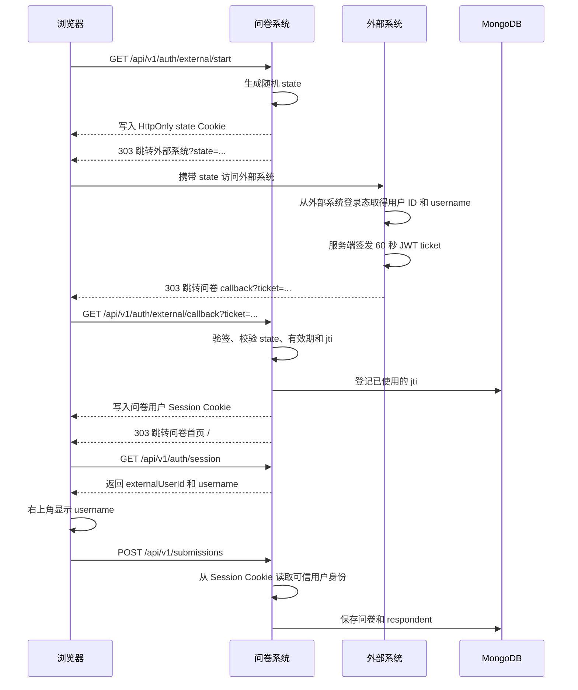

# 外部系统跳转接入说明

## 1. 目标

问卷系统作为外部链接嵌入其他业务系统时，需要完成以下能力：

1. 用户从外部系统进入问卷时，携带稳定的用户 ID 和 `username`。
2. 问卷右上角显示 `username`。
3. 用户提交问卷时，由后端把可信用户身份和问卷一起保存。
4. 未登录用户仍可匿名填写。
5. URL 中的用户信息不能被直接修改后冒充其他用户。

当前项目采用“浏览器绑定的 state + 短时签名票据 + 问卷自身会话”的方式实现，而不是把 `username`、用户 ID 直接拼到问卷 URL 中。

## 2. 系统职责

### 外部系统

- 完成真实用户的登录和身份确认。
- 保存用户的稳定 ID 与展示名称。
- 接收问卷系统生成的 `state`。
- 在服务端签发短时 HS256 JWT 票据。
- 将浏览器跳转到问卷回调地址。

项目中的 `backend/mock_external.py` 是最小模拟实现。真实接入时，用业务系统自己的登录态替换页面上的用户信息输入框即可。

### 问卷系统

- 发起登录流程并生成随机 `state`。
- 验证外部系统签发的 JWT、有效期和 `state`。
- 防止同一张外部票据被重复使用。
- 建立问卷自己的 HttpOnly 用户会话。
- 向前端返回当前用户信息。
- 提交问卷时从后端会话读取身份并写入 MongoDB。

## 3. 完整跳转时序



## 4. 跳转实现

### 4.1 从问卷系统发起登录

外部系统应将“进入问卷”链接指向问卷系统的登录起点：

```text
https://survey.example.com/api/v1/auth/external/start
```

不要直接跳到问卷首页，也不要自行生成 `state`。问卷后端会：

1. 生成随机 `state`。
2. 将 `state` 写入 `dml_sso_state` HttpOnly Cookie，有效期 5 分钟。
3. 以查询参数形式跳转到 `EXTERNAL_PORTAL_URL`。

示例：

```text
https://external.example.com/survey-entry?state=<随机值>
```

模拟系统在直接访问 `http://127.0.0.1:9000/` 且没有 `state` 时，也会先跳到问卷登录起点，因此本地演示可以从模拟系统首页开始。

### 4.2 外部系统签发短时票据

外部系统从自己的服务端登录态取得用户身份，然后签发 JWT。票据使用 HS256，签名密钥必须与问卷后端的 `EXTERNAL_SSO_SHARED_SECRET` 一致。

JWT Payload：

| 字段 | 必填 | 说明 |
| --- | --- | --- |
| `iss` | 是 | 签发方，必须等于 `EXTERNAL_SSO_ISSUER` |
| `aud` | 是 | 接收方，必须等于 `EXTERNAL_SSO_AUDIENCE` |
| `sub` | 是 | 外部系统中的稳定用户 ID，最长 128 字符 |
| `username` | 是 | 问卷右上角展示的用户名，最长 100 字符 |
| `iat` | 是 | 签发时间 |
| `exp` | 是 | 过期时间，当前最长 60 秒 |
| `jti` | 是 | 每张票据唯一的随机 ID，用于防重放 |
| `state` | 是 | 原样返回问卷系统提供的 `state` |
| `token_type` | 是 | 固定为 `external_sso` |

最小 Python 签发示例：

```python
from datetime import UTC, datetime, timedelta
from uuid import uuid4

import jwt

now = datetime.now(UTC)
ticket = jwt.encode(
    {
        "iss": "dml-demo-external",
        "aud": "dml-survey",
        "sub": current_user.id,
        "username": current_user.username,
        "iat": now,
        "exp": now + timedelta(seconds=60),
        "jti": uuid4().hex,
        "state": state_from_query,
        "token_type": "external_sso",
    },
    EXTERNAL_SSO_SHARED_SECRET,
    algorithm="HS256",
)
```

签发后返回 303 跳转：

```text
https://survey.example.com/api/v1/auth/external/callback?ticket=<JWT>
```

票据只能在外部系统服务端签发。共享密钥不能写入浏览器 JavaScript、HTML 或 URL。

### 4.3 问卷回调并建立会话

问卷后端的 `/api/v1/auth/external/callback` 依次执行：

1. 使用共享密钥验证 JWT 签名。
2. 验证 `iss`、`aud`、`token_type` 和必填字段。
3. 验证 `iat`、`exp`，并限制票据最长有效时间。
4. 将票据中的 `state` 与浏览器 HttpOnly Cookie 中的 `state` 做常量时间比较。
5. 将 `jti` 写入 MongoDB；唯一索引确保同一票据只能使用一次。
6. 使用独立的 `USER_SESSION_SECRET` 签发问卷用户会话。
7. 写入 `dml_user_session` HttpOnly Cookie，删除 state Cookie。
8. 303 跳转到 `/`，因此浏览器地址栏中不再保留 JWT。

`consumed_external_tickets` 集合同时配置了 TTL 索引，票据过期后 MongoDB 会自动清理防重放记录。

### 4.4 前端显示用户名

问卷页面加载时请求：

```text
GET /api/v1/auth/session
```

登录用户响应示例：

```json
{
  "authenticated": true,
  "user": {
    "externalUserId": "demo-1001",
    "username": "张三"
  },
  "ssoEnabled": true,
  "loginUrl": "/api/v1/auth/external/start"
}
```

React 前端读取 `user.username` 并显示在右上角。未登录时，`authenticated=false`、`user=null`，页面显示“登录填写，有机会获得奖励”。

退出登录调用：

```text
POST /api/v1/auth/logout
```

后端执行同源校验并删除用户会话 Cookie，前端刷新后恢复匿名状态。

## 5. 保存问卷时关联用户

前端提交的问卷 Payload 不包含可信用户身份。后端通过 `dml_user_session` Cookie 解析当前用户，然后生成 `respondent` 字段并与问卷一起写入 MongoDB。

登录提交示例：

```json
{
  "submission_id": "DML-0123456789ABCDEF",
  "survey_id": "...",
  "respondent": {
    "auth_type": "external",
    "external_user_id": "demo-1001",
    "username": "张三"
  },
  "payload": {}
}
```

匿名提交示例：

```json
{
  "respondent": {
    "auth_type": "anonymous"
  },
  "payload": {}
}
```

这样可以防止调用者在提交接口中伪造 `external_user_id` 或 `username`。登录用户提交和退出操作还会执行同源校验；匿名用户仍可提交问卷。

管理端的问卷列表、详情、筛选和 CSV 导出均可读取这些身份字段。

## 6. 配置项

问卷后端继续通过环境变量配置。独立的 `mock_external.py` 将跳转地址、`iss`、`aud` 和票据时长放在文件顶部常量中，不提供跳转地址默认值；共享签名密钥只从 `EXTERNAL_SSO_SHARED_SECRET` 环境变量读取，不能写入或提交到参考文件。

| 配置项 | 问卷系统 | 独立模拟文件 | 说明 |
| --- | --- | --- | --- |
| `EXTERNAL_SSO_SHARED_SECRET` | 环境变量 | 环境变量 | 两边必须相同；外部票据签名密钥，至少 32 字符且不能是公开示例值 |
| `EXTERNAL_SSO_ISSUER` | 环境变量 | 常量 | 两边必须相同；JWT `iss` |
| `EXTERNAL_SSO_AUDIENCE` | 环境变量 | 常量 | 两边必须相同；JWT `aud` |
| `EXTERNAL_PORTAL_URL` | 环境变量 | 不适用 | 问卷系统跳转到外部系统的入口 |
| `SURVEY_CALLBACK_URL` | 环境变量 | 常量 | 问卷回调地址，模拟系统签发票据后跳转到这里 |
| `SURVEY_LOGIN_START_URL` | 环境变量 | 常量 | 问卷登录起点，直接访问模拟系统时使用 |
| `EXTERNAL_TICKET_MAX_SECONDS` | 环境变量 | 常量 | 两边的允许时长必须一致；必须显式填写 30 到 300 秒的值 |
| `USER_SESSION_SECRET` | 环境变量 | 不适用 | 问卷用户会话密钥，至少 32 字符且不能与共享密钥相同 |
| `USER_SESSION_HOURS` | 环境变量 | 不适用 | 问卷用户会话时长 |
| `USER_SECURE_COOKIE` | 环境变量 | 不适用 | 生产 HTTPS 环境必须设置为 `true` |

共享密钥、用户会话密钥和管理员会话密钥必须各不相同。示例密钥会被程序拒绝，生产环境应使用密码学安全的随机值。

## 7. 本地联调

本项目当前联调地址：

| 服务 | 地址 |
| --- | --- |
| 模拟外部系统 | `http://127.0.0.1:9000/` |
| 问卷前端 | `http://127.0.0.1:5174/` |
| Docker 集成入口 | `http://127.0.0.1:8080/` |

测试步骤：

1. 打开 `http://127.0.0.1:9000/`。
2. 模拟系统自动进入问卷登录流程并获得 `state`。
3. 输入用户 ID 和 `username`，点击“进入问卷”。
4. 浏览器跳回问卷首页。
5. 确认右上角显示 `username`。
6. 提交问卷后，在管理端确认 `authType=external`、用户 ID 和用户名已保存。
7. 点击退出按钮，确认用户名消失并恢复登录入口。

## 8. 常见错误

| 现象 | 可能原因 |
| --- | --- |
| `503 外部系统登录尚未配置` | 密钥不足 32 字符、使用了示例密钥，或会话密钥重复 |
| `401 外部系统登录凭证无效或已过期` | 签名、`iss`、`aud`、字段或有效期不正确 |
| `401 外部系统登录流程无效或已过期` | 未从 `/external/start` 发起、state 不一致或 state Cookie 已过期 |
| `401 外部系统登录凭证已使用` | 相同 `jti` 的票据被重复回放 |
| 登录后仍显示匿名 | 回调域名与前端域名不一致、Cookie 配置错误或会话密钥不一致 |
| 退出或登录提交返回 `403` | 反向代理没有传递真实 Host/协议，导致同源校验失败 |

生产部署时，外部系统入口、问卷回调和 Cookie 都应使用 HTTPS，并正确传递可信的 `X-Forwarded-Host`、`X-Forwarded-Proto`。不要信任客户端自行传入的转发头。

## 9. 相关代码

- `backend/mock_external.py`：最小外部系统和 JWT 签发示例。
- `backend/app/user_api.py`：登录起点、回调、会话查询和退出接口。
- `backend/app/user_auth.py`：用户模型、JWT 验证、问卷会话和提交身份生成。
- `backend/app/repositories/auth.py`：一次性 `jti` 消费记录。
- `backend/app/api.py`：提交问卷时读取后端用户会话。
- `backend/app/services.py`：将 `respondent` 保存到提交文档。
- `frontend/src/services/userSession.ts`：前端会话查询与退出请求。
- `frontend/src/App.tsx`：右上角用户名和登录/退出 UI。
- `frontend/vite.config.ts`、`docker/nginx.conf`：开发和生产代理的真实来源传递。
