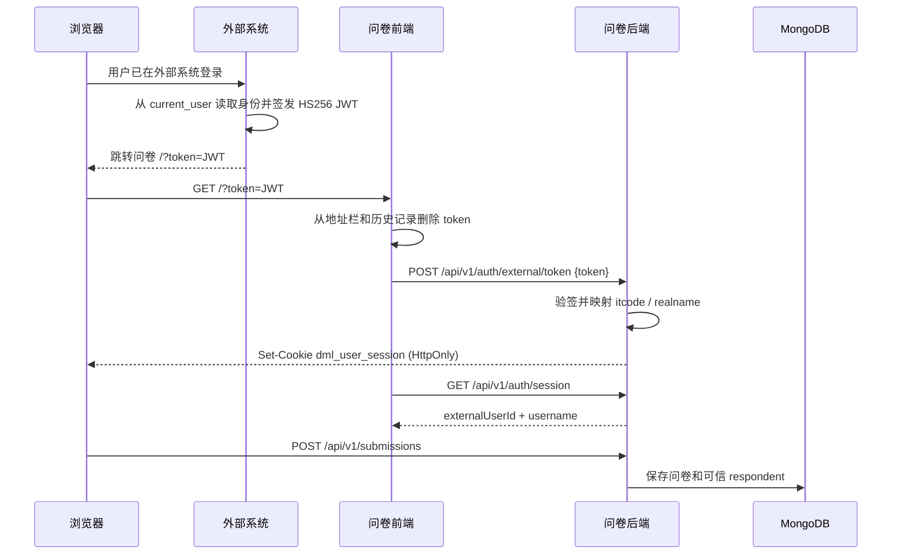

# 外部系统跳转接入说明

## 1. 接入目标

外部业务系统已经完成用户登录后，在服务端签发 HS256 JWT，并将浏览器跳转到问卷：

```text
http://10.17.158.73:8280/?token=<JWT>
```

问卷系统验签后建立自己的 HttpOnly 会话。提交问卷时，后端从会话读取可信身份并写入 MongoDB；未携带 token 的用户仍可匿名填写。

不要把共享密钥或未签名的用户信息交给浏览器。URL 中只携带短时 JWT。

## 2. 双方职责

### 外部系统

- 从自身服务端登录态读取当前用户，不能信任浏览器提交的用户字段。
- 使用 `EXTERNAL_SSO_SHARED_SECRET` 和固定算法 HS256 签发 JWT。
- 将浏览器跳转到 `问卷地址/?token=<JWT>`。
- 推荐为 JWT 增加短时 `iat`、`exp` 和唯一 `jti`。

### 问卷系统

- 前端启动时读取 `token`，立即从地址栏和历史记录中清除它。
- 通过同源 `POST /api/v1/auth/external/token` 将 token 交给后端。
- 后端固定使用 HS256 和共享密钥验签，验证身份字段和可选的 `exp`。
- 使用独立的 `USER_SESSION_SECRET` 建立 HttpOnly 本地会话。
- 提交问卷时从本地会话读取可信用户身份。

## 3. 跳转时序



## 4. JWT 协议

当前兼容的 Payload：

| 字段 | 必填 | 映射或说明 |
| --- | --- | --- |
| `itcode` | 是 | 保存为 `external_user_id`，最长 128 字符 |
| `name` | 是 | 登录名称，最长 100 字符 |
| `realname` | 是 | 显示并保存为 `username`，最长 100 字符 |
| `dept` | 是 | 部门信息，当前只校验、不落问卷文档 |
| `external_user` | 是 | 是否外部用户，当前只校验 |
| `iat` | 推荐 | 签发时间 |
| `exp` | 强烈推荐 | 过期时间；存在时问卷后端会验证 |
| `jti` | 推荐 | token 唯一 ID，为后续防重放预留 |

外部系统 Flask 风格示例：

```python
from datetime import UTC, datetime, timedelta
from urllib.parse import urlencode
from uuid import uuid4

import jwt as jwt_lib


if request.args.get("action") == "gen_token_and_goto_external":
    survey_url = "http://10.17.158.73:8280/"
    now = datetime.now(UTC)
    user_info = {
        "itcode": current_user.itcode,
        "name": current_user.name,
        "realname": current_user.realname,
        "dept": current_user.dept,
        "external_user": current_user.external_user,
        "iat": now,
        "exp": now + timedelta(seconds=60),
        "jti": uuid4().hex,
    }
    token = jwt_lib.encode(
        user_info,
        EXTERNAL_SSO_SHARED_SECRET,
        algorithm="HS256",
    )
    return {
        "status": "success",
        "url": f"{survey_url}?{urlencode({'token': token})}",
    }
```

`EXTERNAL_SSO_SHARED_SECRET` 必须来自服务端环境变量或密钥管理系统，不能硬编码到可分发源码，也不能与 `USER_SESSION_SECRET` 或管理员会话密钥相同。

当前为了兼容已提供的 token 格式，没有强制要求 `iat/exp/jti`。没有 `exp` 的 token 一旦泄露便可长期重放，因此外部系统应尽快按示例补齐短有效期。

## 5. 问卷会话与身份保存

token 交换成功后，问卷后端返回 HttpOnly Cookie。页面随后请求：

```text
GET /api/v1/auth/session
```

响应示例：

```json
{
  "authenticated": true,
  "user": {
    "externalUserId": "wangyy1",
    "username": "王永义"
  },
  "ssoEnabled": true,
  "loginUrl": null
}
```

提交内容中的可信身份由后端生成，前端 Payload 不携带这些字段：

```json
{
  "respondent": {
    "auth_type": "external",
    "external_user_id": "wangyy1",
    "username": "王永义"
  }
}
```

未登录提交保存为 `{"auth_type": "anonymous"}`。

## 6. 配置

| 配置项 | 说明 |
| --- | --- |
| `EXTERNAL_SSO_SHARED_SECRET` | 外部系统和问卷后端共享的 JWT 验签密钥，至少 32 字符 |
| `USER_SESSION_SECRET` | 问卷本地会话密钥，至少 32 字符且必须与共享密钥不同 |
| `USER_SESSION_HOURS` | 问卷本地会话时长 |
| `USER_SECURE_COOKIE` | 生产 HTTPS 环境必须设为 `true` |

修改 `docker/.env` 后需要重建或重新创建后端容器，使环境变量生效。

旧版 `state + ticket` 协议的 `/api/v1/auth/external/start` 和 `/api/v1/auth/external/callback` 暂时保留用于迁移；`EXTERNAL_SSO_ISSUER`、`EXTERNAL_SSO_AUDIENCE`、`EXTERNAL_PORTAL_URL` 和 `EXTERNAL_TICKET_MAX_SECONDS` 仅旧流程使用。

## 7. 联调步骤

1. 确认外部系统与问卷后端的 `EXTERNAL_SSO_SHARED_SECRET` 完全一致。
2. 外部系统用测试用户生成短时 token，并返回问卷 `/?token=...` 地址。
3. 浏览器打开该地址后，确认地址栏很快恢复为 `/`，不再保留 token。
4. 确认右上角显示 `realname`。
5. 请求 `/api/v1/auth/session`，确认 `authenticated=true` 且用户映射正确。
6. 提交测试问卷，在管理端确认 `authType=external`、用户 ID 和用户名已保存。
7. 点击退出，确认会话被删除并恢复匿名状态。

## 8. 常见错误

| 现象 | 可能原因 |
| --- | --- |
| `503 外部系统登录尚未配置` | 共享密钥或本地会话密钥未配置、长度不足、使用示例值或密钥重复 |
| `401 外部系统登录凭证无效或已过期` | 两端密钥不同、签名算法错误、缺少必填字段、字段格式错误或 `exp` 已过期 |
| 页面显示“登录失败” | 前端已收到 token，但后端交换接口拒绝了凭证 |
| 登录后仍显示匿名 | Cookie 域名/协议配置错误，或反向代理没有正确转发请求 |
| URL 一直保留 token | 前端仍在运行旧镜像，需要重新构建前端 Docker 镜像 |

生产环境必须使用 HTTPS，并将 `USER_SECURE_COOKIE=true`。由于 token 初次进入时位于查询参数，代理访问日志也应避免记录完整查询字符串。

## 9. 相关代码

- `backend/app/user_auth.py`：外部 JWT 验签、身份映射和本地会话。
- `backend/app/user_api.py`：token 交换、会话查询和退出接口。
- `frontend/src/services/userSession.ts`：清理 URL 并交换 token。
- `frontend/src/main.tsx`：React 渲染前完成外部登录引导。
- `backend/app/services.py`：将可信 `respondent` 保存到提交文档。
